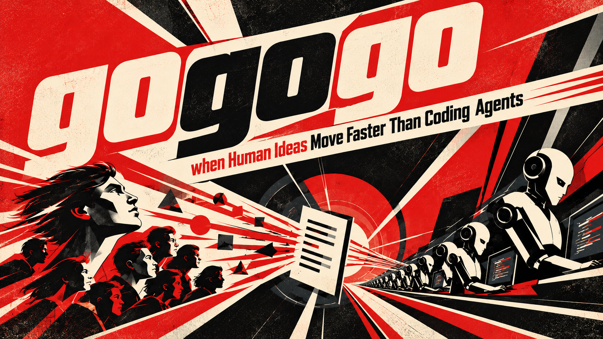
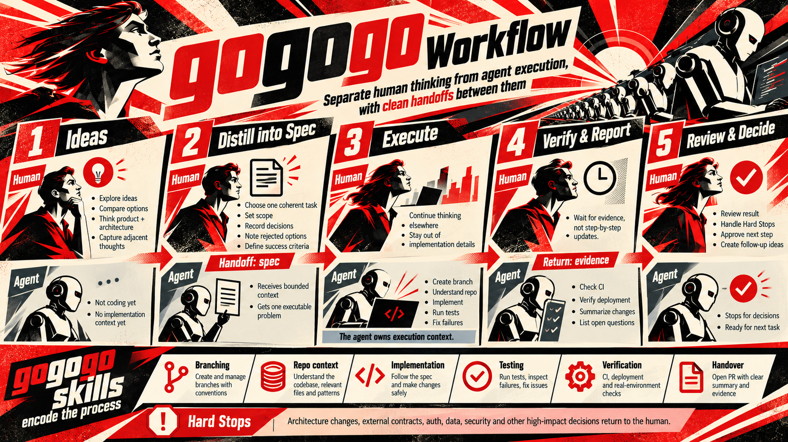

# gogogo

**Let Claude work on its own for hours, not minutes: through a queue of
issues, from a report to verified code on a real environment, stopping only
where a person has to decide.**

## Why it exists

Left to itself, Claude Code works for a few minutes and then stops: to ask a
question, to wait for a permission, or because the request is done and the
next one is still in your head. gogogo is built to make that stretch much
longer. Decisions are made up front, the work is queued, and the rules for
when to stop are written down, so Claude can carry on through issue after
issue without you.

A coding agent is slow at the scale of a person's attention. One request
(read the issue, find the cause, change the code, run the tests, review)
takes Claude minutes, often tens of minutes. Watching it wastes the person.
Switching away and back wastes them too: every return means picking the
context up again and answering whatever the agent stopped to ask.

The way out is to stop handing the agent one request at a time and give it a
queue instead: a pipeline of issues it works through on its own for hours,
overnight or over a weekend, while the person does something else.

A queue only works if every item in it can be finished without asking anyone.
That moves the hard work to the front. Each issue has to be fully specified
before the agent starts: what is wrong, how to check the fix by hand, which
risky decisions the owner has already made, and which ones the agent must not
make alone. And the agent has to be trusted to stop rather than guess, to
prove a fix on real data rather than a green test suite, and to say plainly
what it did and did not do.

gogogo is that workflow, written down as Claude Code skills:
`/gogogo:spec` turns a vague report into work an agent can finish alone,
`/gogogo:auto-dev` works the queue unattended and stops where a person has to
decide, and the other skills keep the board, the tests and the hand-back
honest.

## Start here

You need Claude Code, a GitHub repo with Issues, and the `gh` CLI logged in
with project access (`gh auth refresh -s project`). Install the plugin in the
repo first ([Adopting it in a repo](#adopting-it-in-a-repo), step 1).

**First: one idea, with you watching.**

1. **`/gogogo:setup`**: checks the repo and sets up what is missing (the
   profile that describes your project, the board and its columns, the ready
   label). It asks before writing anything.
2. **`/gogogo:spec`**: describe your idea, or give it an existing issue. It
   asks you questions until every decision is made, writes the spec into the
   issue (filing one if there isn't one yet), marks it ready and moves its card
   to the `Dev Ready` column (not when someone is already working on it). Several issues, or a whole column, go in one
   run, one issue at a time: `/gogogo:spec #12 #14` or
   `/gogogo:spec everything in New`.
3. **`/gogogo:dev <issue>`**: builds that one issue end to end. It finds the
   cause, changes the code, reviews it, verifies it on a real environment,
   reports on the issue and moves its card. Watch what it does.

**Then: many ideas, without you.**

1. **`/gogogo:spec`** on each idea. This is where your time goes: answering
   its questions now is what lets the run go on later without asking.
2. **`/gogogo:auto-dev`** in a session started without permission prompts:
   ```bash
   claude -n "$(basename "$(git rev-parse --show-toplevel)")-autodev" --permission-mode bypassPermissions "/gogogo:auto-dev"
   ```
   The `-n` name is what `/resume` and the terminal title show for the run.
   Telegram messages when it starts, changes state and closes are optional:
   `/gogogo:setup` sets them up, and a run without them works the same.
   Before you start it, log a browser in to the environment where the agent
   checks fixes before merging: the run checks this first and stops at a login
   page rather than skip verification.
   It takes each issue in `Dev Ready` that carries the ready label, or whose
   spec passes the linter (and then labels it), one at a time: branch, build, test,
   review, verify, merge, move the card, next. An issue it cannot finish alone
   (a failed check, a fix it could not prove) goes to the `Human!Help!` column
   with a note saying what you need to do; one still missing a decision is
   skipped and named in the run's report. Preview the run first with
   `/gogogo:auto-dev --triage-only`, which changes nothing.

### auto-dev under `/goal`

[`/goal`](https://code.claude.com/docs/en/goal) keeps a session taking turns
until a small model, reading only the transcript, judges a condition met or
impossible. auto-dev already works the whole queue in one run, so a goal adds
little to a run that ends with its close-run report. What it adds is
persistence: a goal retries a turn that failed on a dropped connection, and
after a usage limit it pauses, then carries on if the session waits for the
reset.

The risk is a goal that names an outcome instead of the process. When auto-dev
refuses to start or stops for you, the evaluator only sees "not met yet" and
tells the next turn to keep going, so the agent works around the skill: it
builds issues with its own subagents, skips review, verification and merge,
and parks cards in `Human!Help!` with no note
([#84](https://github.com/Vorski-Imagineering/gogogo/issues/84); the shared
`tracker.py` now refuses that move unless the issue's newest comment says why,
but a goal can still route around the skill in other ways).

Use a goal when all of these hold:

- the session runs in `bypassPermissions`, as above. The `/goal` docs suggest
  auto mode, but auto mode refuses the merge;
- `/gogogo:auto-dev --triage-only` takes the issues you expect;
- the condition names the skill, and makes a refusal or a stop the end:
  ```text
  /goal /gogogo:auto-dev has finished and printed its close-run report. Work issues only through /gogogo:auto-dev. If it refuses to start, that ends the goal: report why and change nothing to get round it.
  ```

Don't use one when:

- auto-dev or dev refuses to start. Fix that first, with
  `/gogogo:setup` and you there;
- the condition is open-ended ("get done what we can") or a board state ("Dev
  Ready is empty"): moving cards meets it without doing the work;
- the queue still needs decisions. `/gogogo:spec` needs you, and a goal
  pushes past questions;
- you are working the same issues in another session.

## Who it is for

It has been run by one developer across several products on different stacks,
and it is shaped for a small team: one owner who makes the decisions, issues
and a board on GitHub, and a few repos that should all work the same way.

Bigger teams probably already have something more sophisticated: ticket
workflows, review rotations, release engineering, compliance gates. gogogo
does not try to replace any of that.

You need Claude Code, GitHub Issues with a GitHub Project board, and the `gh`
CLI.

## Have we reinvented something?

Possibly, and it is a fair question to ask before adopting this. By late 2026
much of the ground is covered by products:

- **Issue to pull request**: GitHub Copilot's coding agent (assign it an
  issue, get a PR), OpenAI Codex, Google Jules, Devin, Cursor's background
  agents, and Claude Code's own GitHub Actions integration.
- **Spec first, then build**: GitHub Spec Kit and Amazon's Kiro.

What we have not found in one place, and what gogogo is mostly about:

- a ready queue worked unattended one issue after another, with a check
  (`spec_lint.py`) on what is allowed into it;
- an owner's decisions recorded in the issue, licensing the risky changes, and
  a list of Hard Stops the agent halts on when a decision is missing;
- "done" meaning run on a real environment, with the card moved only as far as
  the code has really got, and Done reached only when a person confirms the
  fix, or a `/gogogo:auto-test` PASS does where the repo sends PASS to Done;
- one process across repos on different stacks, with what differs kept in one
  profile file per repo.

If you know a product that already does all of this, please open an issue and
tell us.

## How it measures up

In October 2026 we checked the whole process against DORA, GitHub, OpenSSF,
OWASP and Anthropic's own guidance, and traced an issue through every merge
shape. The full write-up, with sources and ranked findings, is
[docs/process-review-2026-10.md](docs/process-review-2026-10.md).

**What follows current practice:**

- **The git and pull request mechanics.** One short-lived branch per issue,
  cut from a fresh base (or the issue's earlier branch, brought up to date),
  squash-merged and deleted. A new test must be seen
  failing before it is trusted. CI is judged check by check, and "no checks
  ran" counts as a failure. Every merge is read back from the base branch
  before anyone is told it landed.
- **Approval up front, not per change.** DORA's research found that external
  change-approval boards slow delivery without lowering the failure rate.
  gogogo has no board and no per-change gate: the owner's decisions are
  recorded once, in the spec, before any code exists.
- **Linking a change to its issue without closing it.** A `Ships-issue`
  trailer instead of `Fixes #n`, because GitHub closes an issue the moment a
  `Fixes` pull request merges, before anyone has seen the fix running.
- **"Done" means run on real data.** A green test suite only counts as
  "written".
- **Stopping honestly.** Three attempts per issue, each on a different theory;
  then the branch is pushed and parked with a note saying what was tried.

**What is original:**

- **The spec as an executable contract.** A linter keeps the ready label off
  an issue until its spec has an Approvals table, a hand check, and a Hard
  Stop verdict that agrees with its own answers.
- **Hard Stops with a licence.** The owner names the dangerous categories
  (schema, auth, money) once; each spec approves them one change at a time.
  Some changes need two approvals: one for the design and one for applying it
  to a shared environment.
- **A release trail that keeps the board true.** A trailer in the commit, a
  tag cut after the deploy, and CI moving each card when a tag ships its
  commits, so the board shows where the code really is without anyone
  updating it by hand.
- **A stated position on code review.** Nobody reads the code except the core
  data model. Instead of rubber-stamping agent pull requests, gogogo relies on
  checks that scale with the volume of code: tests seen failing, verification
  on real data, and a person confirming the behaviour.

## What it is

`gogogo` is a Claude Code plugin with the development process shared by
Vorski-Imagineering projects. An issue gets a spec that another agent can build
from without asking anything. One command builds one issue end to end. Another
works the whole ready queue unattended, stopping where a human has to decide.
The skills are the same in every repo. What differs (the tracker, the test
commands, the environments, the Hard Stop rules) lives in one file per repo,
`.agents/dev-process.md`, which every skill reads first.

## The process



```
 report ──► /gogogo:spec ──► "dev ready" ──► /gogogo:auto-dev ──► PR / merge ──► stages ──► a human confirms
            (asks, decides,     (label)      (or /gogogo:dev        (by the repo's   (dev, staging,
             writes the spec)                  for one issue)        own rules)       production…)
```

1. **Spec.** A vague report becomes a spec in the issue body: the original
   report, how to check the fix by hand, an **Approvals** table recording every
   decision the owner made, the design, test cases, files and a **Hard-stop
   check**. A linter blocks the ready label until the spec holds together.
2. **Build.** The agent reads the issue, finds the real cause (often data or
   configuration rather than code), and makes the change. Before the review, a
   reader that has not seen how it was built checks the change item by item
   against the spec, and every gap is built, matched or declared. Then it runs `/code-review`,
   applies a finding only when there is evidence for it and gives each one
   three attempts, and watches the new test fail before trusting that it
   passes. Where the repo's profile has a mutation command, it mutates the
   changed lines and kills or accounts for every mutant the tests miss.
3. **Verify.** "Done" means the path was run on real data in the pre-merge
   environment. A green test suite alone only counts as "written".
4. **Hand back.** A comment in the reporter's words, and the card moves only as
   far as the code has actually got. No skill that writes code moves it to Done. A person
   confirms the fix, or, where the repo runs `/gogogo:auto-test`, a PASS there
   moves the card to the profile's `auto_test.pass_column` (Done, in some
   repos) and closes the issue when `auto_test.pass_closes` is true.

**What makes it safe to leave running:**

- **Hard Stops.** Changes the repo's owner must approve (schema, auth, money,
  shared data…) are listed in the repo's `CLAUDE.md`. A spec approves them one
  at a time. Anything not approved, the loop stops on.
- **A release only after every gate.** Where a merge deploys to production,
  the loop merges an issue only when every check passed, its review ended clean
  and its pull request's tests are green, in a session started in bypass mode.
  Anything else waits at a pull request.
- **Every card move is read back**, and every merge is checked against the base
  branch before anyone is told it landed.
- **It gives up properly.** At most three attempts per issue, each with a
  different theory. Then the attempts are committed to the issue's branch,
  pushed and left unmerged, and the card goes to the `Human!Help!` column with
  what each attempt ruled out. No run takes it from there until a person moves
  it on; the loop goes on to the next issue.

**When is a review enough?** The review loop is where an unattended run spends
most of its time, and it does not always stop: our last four code reviews took
8, 11, 17 and 20 rounds. Research and other teams' experience point the same
way: most of the value comes in the first two or three rounds, later rounds can
make a change worse, and a loop converges when findings are judged against the
spec and a loop that will not settle goes to a person.
That is how the skills now work
([#33](https://github.com/Vorski-Imagineering/gogogo/issues/33)): a finding is
applied only with evidence, each finding gets three attempts, a fix is never
undone and redone, and a review past 13 rounds goes to a person.
[docs/when-is-enough-enough.md](docs/when-is-enough-enough.md) has the numbers,
the sources with the dates we read them, and the rule; `review_stats.py` reads
the review records back.

**Branches and pull requests.** Every issue gets its own branch,
`fix/<issue-number>-<slug>`, cut from a freshly pulled base: a stale base would silently undo the
previous merge, and the issue number ties the branch back to the tracker. An
issue that already has a branch or an open pull request continues on it
instead, merged up to date with the base (`issue_work.py` finds it). The loop takes one issue at a time: branch, build, review, verify,
then merge by the repo's chosen strategy. That is a pull request per issue
squashed into the base (`pr-squash`), pull requests into a dated run branch
that reaches the main line as one final PR (`run-branch-pr`), or the repo's
own merge script (`merge-script`). A pull request merges only after its
tests, review rounds, gates and, when the merge is a release or the repo
requires it, its CI checks have all passed. The squash commit carries a
`Ships-issue` trailer linking it to the issue, so a later deploy tag can tell
which issues it shipped. Every merge is read back from the base branch before
the card moves. An issue that stops (a missing decision, a failed review, a
fix it could not prove) keeps its branch pushed and unmerged for a person to
pick up. Branches no open issue claims are reported, never deleted or
rebased.
[docs/git-process.md](docs/git-process.md) has the details.

## Skills

| Command | What it does |
|---|---|
| `/gogogo:spec` | Turns an issue into a spec another agent can build from without asking. Asks the owner in rounds, records the decisions, lints the result. |
| `/gogogo:idea` | Files what the session has found as an un-specced issue (request, findings, open questions), after showing you the draft. No further research; `/gogogo:spec` designs it later. |
| `/gogogo:dev` | One issue end to end: read, triage, find the cause, change, review, verify on real data, report, move the card. |
| `/gogogo:auto-dev` | Works the ready queue unattended, one issue after another, each on its own branch. `--triage-only` reads the queue and changes nothing. |
| `/gogogo:setup` | Opens with the repo's setup and configuration, then onboards it, or checks it is still set up right: plugin settings, profile, Hard Stops, board and columns, ready label, competing local skills. |
| `/gogogo:wrap-up` | Before you close a session: finds anything uncommitted, unpushed, stranded or still running, saves what the session learned, and says plainly whether it is safe to close. |
| `/gogogo:tech-eval` | Evaluates a library, service or tool against the repo before anyone adopts it, and records the verdict in the repo's decisions register. |
| `/gogogo:status` | Where things stand in this repo: cards per board column, what is queued, in progress and released, open pull requests, and branches and worktrees holding work. Reads only; gives no verdicts. |
| `/gogogo:roadmap` | Keeps a roadmap document's status marks in step with the board: re-derives every row's mark from the issue's state and column, fixes the notes the change made stale, and commits the document, opening a PR for it when the roadmap shares the repo. |
| `/gogogo:auto-test` | Tests each shipped issue on the environment where a person confirms fixes, and records PASS, FAIL or NEEDS HUMAN on the issue. `--triage-only` lists what it would test or skip and changes nothing. |

A session started or resumed in a repo with a profile opens with a one-line
status from the plugin's own hook (cards in each profile column, open pull
requests), shown only to the person and never added to Claude's context.

Scripts the skills call, all in `plugins/gogogo/scripts/`:

- `profile_check.py`: reads and validates the repo's profile.
- `spec_lint.py`: checks a spec's layout, approvals and hard-stop verdict.
- `test_guard.py`: lists the test hunks a change touched and checks a reader's same, stronger or weaker verdict on each against the spec.
- `spec_check.py`: lists a spec's items and checks that a reader answered every one against the change.
- `tracker.py`: lists and moves cards on a GitHub Project board, by column name, with read-back, and refuses a move to the needs-a-person column unless the issue's newest comment says why.
- `verify_merged.py`: confirms a PR's merge is really on the base branch.
- `stage_sync.py`: writes the `Ships-issue` link at merge, and moves cards to a stage when a tag ships their commits (run by a repo's CI).
- `release.py`: numbers a production release, cuts its annotated `deploy-<build>` tag after the deploy, and prints the notes listing the issues it shipped.
- `stranded_work.py`: finds local and `origin` branches holding work that nothing accounts for (no open issue, or an open issue with no open pull request and no stop marker naming the branch), and says what became of each branch's pull request.
- `worktree_sweep.py`: removes the worktrees whose pull request merged or whose issue is closed, and keeps any with uncommitted changes, commits on no remote, or an open issue whose work has not merged. Without `--apply` it only lists.
- `issue_work.py`: finds an issue's earlier work (open pull requests that reference it, branches named for it, the branch its stop marker names), so dev and auto-dev continue on it rather than start again.
- `notify.py`: sends a run's messages by the profile's `notify` (Telegram today). With no `notify` line, messages are on whenever the machine has bot credentials (per user, or in the repo's own git-ignored `.claude/gogogo/notify.env`); `notify = "none"` turns a repo off. Off, or no credentials on the machine, sends nothing.
- `review_stats.py`: reads back the review record on each issue and sums them up: rounds, why findings were applied or declined, how each review ended and what became of the issue, plus phase times, session ids, stops by reason, triage skips, and each session's issues taken, handed back and skipped.
- `require_unattended.sh`: refuses to start the loop unless the session can run without prompts.
- `setup_check.py`: the read-only check behind `/gogogo:setup`.
- `roadmap_status.py`: compares a roadmap document's marks with the tracker, and rewrites the ones that disagree with `--write`.
- `session_status.py`: the plugin's session-start hook; prints that one-line status, or nothing outside a repo with a profile.
- `record_outcome.py`: renders and records an auto-test outcome: comment first, then labels, close and card, then reads the issue back.

## One process, many stacks

The skills never name a project, host or command. Each repo describes itself in
`.agents/dev-process.md`: a settings block plus a few prose sections.

- **tracker**: where issues live, the board, its columns and the ready label.
- **environments and stages**: where code runs before and after a merge, and
  which one is production.
- **lanes**: the repo's own test commands.
- **Hard Stops**: which of the repo's rules need the owner's sign-off.
- **recon traps**: what this codebase hides from a newcomer.

A Django app deployed from a server checkout and a Firebase app with a staging
site run the same skills. The format is in
[`references/profile-schema.md`](plugins/gogogo/references/profile-schema.md).

## Adopting it in a repo

`/gogogo:setup` and the board steps need a `gh` login with project access:
`gh auth refresh -s project`.

**1. Install the plugin for the repo.** From the repo's root:

```bash
claude plugin marketplace add Vorski-Imagineering/gogogo --scope project
claude plugin install gogogo@vorski-skills --scope project
```

This writes `.claude/settings.json`. Set `"autoUpdate": true` on the
`vorski-skills` marketplace entry and commit the file: everyone who opens the
repo then gets the plugin.

**2. Run `/gogogo:setup`.** It checks everything and fixes what is missing,
one step at a time, asking before anything is written:

- **The profile.** It drafts `.agents/dev-process.md` by reading the repo:
  test commands from scripts and CI, environments from the deploy setup, the
  tracker from the remote. You read the draft and approve it, since it
  describes how your project works.
- **Hard Stops.** It points at the repo's own list in `CLAUDE.md`. If there
  isn't one, it stops and asks. Which changes need sign-off is the owner's
  call, never the skill's.
- **The board.** A GitHub Project with the standard columns: `Future` ·
  `⚡️ New` · `Backlog` · `Dev Ready` · `In progress` · `Human!Help!` · one
  per stage (for example "In Dev", "In Staging", "Released") · `Done`. New
  issues land in ⚡️ New for you to triage; the loop works Dev Ready, and moves
  an issue that stopped and needs you to Human!Help!. It can create the board,
  or check the one you have.
- **Where each issue's work goes.** It asks you outright, explaining what
  each choice changes day to day: the checkout you already work in
  (recommended for one person working normally), or a worktree per issue
  beside it (for several sessions at once, or a checkout something live runs
  from; this support is in development). The answer is the profile's
  `integration.workspace`, and `/gogogo:dev` and `/gogogo:auto-dev` do what it
  says.
- **The ready label** (`dev ready` by default).
- **Local skills this replaces.** Their project-specific text moves into the
  profile word for word, and the old copies go to `.claude/skills-retired/`.
- **A pointer in `CLAUDE.md`**, so every session knows where the process lives.

Run it again at any time to check that a repo is still set up right.

**3. Prove it.** In a fresh session, the `/` menu shows the `gogogo:` skills
and none of the retired ones, and `/gogogo:auto-dev --triage-only` reads the
queue and changes nothing.

**4. Start small**, as in [Start here](#start-here): one issue attended with
`/gogogo:dev`, then the queue with `/gogogo:auto-dev`. The loop refuses to
start in a session that would stop for permission prompts, or without a
browser logged in to the pre-merge environment. Give it a checkout of its own,
so it never shares a working tree with you.

**Keeping it current.** `autoUpdate` refreshes the plugin when an interactive
session starts. To update by hand:

```bash
claude plugin marketplace update vorski-skills
claude plugin update gogogo@vorski-skills --scope project
```

**Changing the process.** Anything specific to one repo goes in that repo's
`.agents/dev-process.md`. A change to how every repo works is a PR here.

## Using gogogo, or working on it

There are two ways to have gogogo on a machine, for two different jobs.

| | **Using the skills** | **Working on gogogo itself** |
|---|---|---|
| Who | Anyone running the skills in an adopting repo, on any machine | Someone changing a skill or script here |
| What you need | The repo. Its `.claude/settings.json` names the plugin, but each machine installs it once: accept the prompt when you first open the repo, or run `claude plugin install gogogo@vorski-skills --scope project` from its root (`update` fails with "not installed" until then) | A clone of this repo |
| Where the skills load from | Claude Code's plugin cache (`~/.claude/plugins/cache/…`), one copy per repo | Your clone: `claude --plugin-dir <clone>/plugins/gogogo` |
| Who keeps it current | Claude Code: `autoUpdate` refreshes it when an interactive session starts. Before a headless or unattended run, update by hand (above) | You: `git pull`. Nothing updates a clone for you |
| Sees unmerged changes | No: only what is merged to `main` | Yes: whatever the clone has checked out |

Use the first for everything except developing gogogo. A clone is not needed to
run any skill, and a clone left behind on an old commit quietly runs old
skills. When a repo needs gogogo's code outside a skill (for example a script its
CI imports), it vendors a pinned copy fetched from GitHub at a commit, not from a
local clone.

## Working on this repo

```bash
python3 -m unittest discover -s tests
```

Read [`CLAUDE.md`](CLAUDE.md) first: skills hold only what is the same in every
repo, and changes to skill behaviour, the profile format or what a script
writes need approval.

- [`docs/history.md`](docs/history.md): where gogogo came from.
- [`docs/process-review-2026-10.md`](docs/process-review-2026-10.md): the process checked against current practice, every merge shape traced, and the ranked findings.
- [`docs/process-measures.md`](docs/process-measures.md): what to measure about the process (quality, speed, tokens) and where the data is.
- [`CONTRIBUTING.md`](CONTRIBUTING.md) and [`SECURITY.md`](SECURITY.md).
- [`.agents/dev-process.md`](.agents/dev-process.md): this repo's own profile, as a worked example.

## License

MIT. See [LICENSE](LICENSE).
